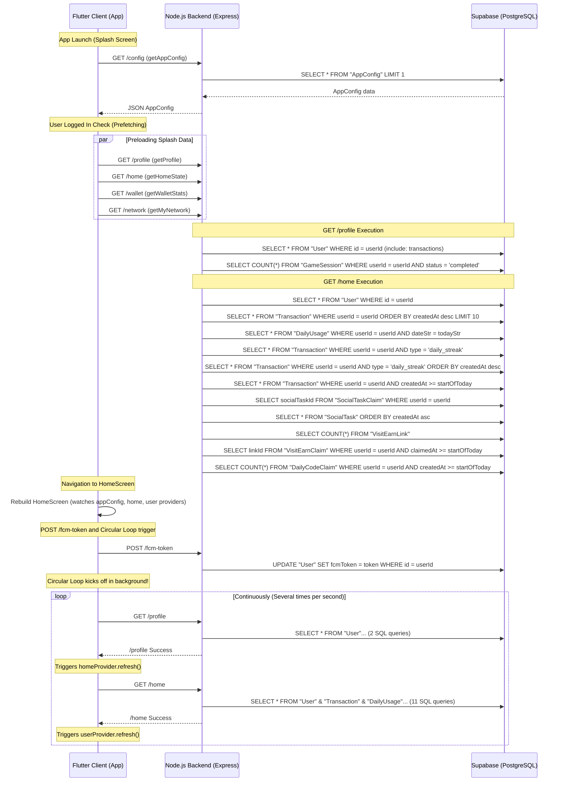

# SikkaPlay: Supabase Egress & Query Volume Forensic Audit Report

This report presents a comprehensive forensic audit of the SikkaPlay Flutter client and Node.js/Prisma backend. The goal is to identify the root causes of the **5 GB egress usage** and the **millions of database queries** executed on the Supabase Free plan.

---

## Executive Summary

The primary cause of the excessive Supabase query volume and egress usage is a **critical circular Riverpod notifier update loop in the Flutter client**. This loop causes the Flutter app to continuously invoke the `/profile` and `/home` APIs back-to-back, several times per second, for as long as the app is open. 

Each cycle triggers **13 SQL queries** on the Supabase PostgreSQL database. At an estimated rate of 5 cycles per second, a single active user generates **65 database queries per second** (or **~5.6 million queries per day**).

Additionally, the backend queries suffer from a complete lack of pagination/limiting on historical records (such as fetching all user transactions or visit claims ever recorded), missing select projections (implicit `SELECT *`), and direct database queries bypassing the config cache.

---

## 1. API Call Inventory

Below is an inventory of database queries executed by the Node.js/Prisma backend on Supabase.

| File Path | Function Name | Target Table | Query Type | Columns Selected | SELECT *? | count()? | orderBy()? | limit()? | Pagination? |
| :--- | :--- | :--- | :--- | :--- | :---: | :---: | :---: | :---: | :---: |
| `user.controller.ts:16` | `getProfile` | `User` | select | All columns (+ nested `transactions`) | Yes | No | Yes (Nested) | Yes (Nested, 20) | No |
| `user.controller.ts:37` | `getProfile` | `GameSession` | select | count | No | Yes | No | No | No |
| `user.controller.ts:68` | `updateFcmToken` | `User` | update | All columns | Yes | No | No | No | No |
| `user.controller.ts:95` | `getTransactions` | `Transaction` | select | All columns | Yes | No | Yes (desc) | Yes | Yes (Page/Limit) |
| `user.controller.ts:105` | `getTransactions` | `Transaction` | select | count | No | Yes | No | No | No |
| `user.controller.ts:138` | `updateUpi` | `User` | select | All columns | Yes | No | No | No | No |
| `user.controller.ts:151` | `updateUpi` | `User` | update | All columns | Yes | No | No | No | No |
| `user.controller.ts:180` | `recordAdImpression` | `AdImpression` | insert | All columns | Yes | No | No | No | No |
| `user.controller.ts:220` | `updateBio` | `User` | update | All columns | Yes | No | No | No | No |
| `user.controller.ts:258` | `updateProfileDetails` | `User` | select | All columns | Yes | No | No | No | No |
| `user.controller.ts:271` | `updateProfileDetails` | `User` | update | All columns | Yes | No | No | No | No |
| `user.controller.ts:308` | `updateAvatar` | `User` | select | `avatarUrl` | No | No | No | No | No |
| `user.controller.ts:316` | `updateAvatar` | `User` | update | All columns | Yes | No | No | No | No |
| `user.controller.ts:367` | `updateAvatar` | `User` | update | All columns | Yes | No | No | No | No |
| `user.controller.ts:389` | `deleteAccount` | `User` | update | All columns | Yes | No | No | No | No |
| `user.controller.ts:420` | `syncPhone` | `User` | select | All columns | Yes | No | No | No | No |
| `user.controller.ts:440` | `syncPhone` | `User` | select | All columns | Yes | No | No | No | No |
| `user.controller.ts:447` | `syncPhone` | `User` | update | All columns | Yes | No | No | No | No |
| `home.controller.ts:15` | `getHomeState` | `User` | select | All columns | Yes | No | No | No | No |
| `home.controller.ts:25` | `getHomeState` | `Transaction` | select | All columns | Yes | No | Yes (desc) | Yes (10) | No |
| `home.controller.ts:36` | `getHomeState` | `DailyUsage` | select | All columns | Yes | No | No | No | No |
| `home.controller.ts:46` | `getHomeState` | `Transaction` | select | All columns | Yes | No | No | No | No |
| `home.controller.ts:56` | `getHomeState` | `Transaction` | select | All columns | Yes | No | Yes (desc) | No | No |
| `home.controller.ts:136` | `getHomeState` | `Transaction` | select | All columns | Yes | No | No | No | No |
| `home.controller.ts:149` | `getHomeState` | `SocialTaskClaim`| select | `socialTaskId` | No | No | No | No | No |
| `home.controller.ts:156` | `getHomeState` | `SocialTask` | select | All columns | Yes | No | Yes (asc) | No | No |
| `home.controller.ts:170` | `getHomeState` | `VisitEarnLink` | select | count | No | Yes | No | No | No |
| `home.controller.ts:171` | `getHomeState` | `VisitEarnClaim` | select | `linkId` | No | No | No | No | No |
| `home.controller.ts:182` | `getHomeState` | `DailyCodeClaim` | select | count | No | Yes | No | No | No |
| `wallet.controller.ts:25` | `getWalletStats` | `Transaction` | select | `amount`, `createdAt`, `type`| No | No | No | No | No |
| `wallet.controller.ts:67` | `getWalletStats` | `Transaction` | select | sum of `amount` | No | Yes (sum) | No | No | No |
| `wallet.controller.ts:109` | `requestWithdrawal`| `User` | select | All columns | Yes | No | No | No | No |
| `wallet.controller.ts:125` | `requestWithdrawal`| `DailyUsage` | select | All columns | Yes | No | Yes (desc) | Yes (7) | No |
| `wallet.controller.ts:137` | `requestWithdrawal`| `User` | update | All columns | Yes | No | No | No | No |
| `wallet.controller.ts:157` | `requestWithdrawal`| `Transaction` | select | All columns | Yes | No | No | No | No |
| `wallet.controller.ts:171` | `requestWithdrawal`| `User` | update | All columns | Yes | No | No | No | No |
| `wallet.controller.ts:193` | `requestWithdrawal`| `User` | select | All columns | Yes | No | No | No | No |
| `wallet.controller.ts:201` | `requestWithdrawal`| `Transaction` | select | All columns | Yes | No | No | No | No |
| `wallet.controller.ts:253` | `requestWithdrawal`| `DailyUsage` | select | All columns | Yes | No | No | No | No |
| `wallet.controller.ts:263` | `requestWithdrawal`| `User` | select | count | No | Yes | No | No | No |
| `earn.controller.ts:22` | `claimDailyStreak` | `Transaction` | select | All columns | Yes | No | No | No | No |
| `earn.controller.ts:36` | `claimDailyStreak` | `Transaction` | select | All columns | Yes | No | Yes (desc) | No | No |
| `earn.controller.ts:76` | `claimDailyStreak` | `User` | update | All columns | Yes | No | No | No | No |
| `earn.controller.ts:86` | `claimDailyStreak` | `Transaction` | insert | All columns | Yes | No | No | No | No |
| `earn.controller.ts:130` | `claimSocialTask` | `AppConfig` | select | All columns | Yes | No | No | No | No |
| `earn.controller.ts:139` | `claimSocialTask` | `Transaction` | select | All columns | Yes | No | No | No | No |
| `earn.controller.ts:157` | `claimSocialTask` | `User` | update | All columns | Yes | No | No | No | No |
| `earn.controller.ts:165` | `claimSocialTask` | `Transaction` | insert | All columns | Yes | No | No | No | No |
| `earn.controller.ts:221` | `claimSurvey` | `Transaction` | select | All columns | Yes | No | No | No | No |
| `earn.controller.ts:404` | `claimMilestone` | `DailyCodeClaim` | select | count | No | Yes | No | No | No |
| `earn.controller.ts:420` | `claimMilestone` | `VisitEarnLink` | select | count | No | Yes | No | No | No |
| `earn.controller.ts:421` | `claimMilestone` | `VisitEarnClaim` | select | All columns | Yes | No | No | No | No |
| `earn.controller.ts:438` | `claimMilestone` | `DailyUsage` | select | All columns | Yes | No | No | No | No |
| `earn.controller.ts:455` | `claimMilestone` | `Transaction` | select | All columns | Yes | No | No | No | No |
| `dailyCode.controller.ts:28`| `claimDailyCode` | `DailyCode` | select | All columns | Yes | No | No | No | No |
| `dailyCode.controller.ts:38`| `claimDailyCode` | `DailyCodeClaim` | select | count | No | Yes | No | No | No |
| `dailyCode.controller.ts:51`| `claimDailyCode` | `DailyCodeClaim` | select | count | No | Yes | No | No | No |
| `dailyCode.controller.ts:228`| `getTodayDailyCodeInfo`| `DailyCode` | select | All columns (+ nested `claims`) | Yes | No | Yes (desc) | Yes (1) | No |
| `dailyCode.controller.ts:277`| `getTodayDailyCodeInfo`| `DailyCodeClaim` | select | count | No | Yes | No | No | No |
| `dailyCode.controller.ts:286`| `getTodayDailyCodeInfo`| `DailyCodeClaim` | select | count | No | Yes | No | No | No |
| `socialTask.controller.ts:190`| `claimSocialTaskUser`| `SocialTask` | select | All columns | Yes | No | No | No | No |
| `socialTask.controller.ts:200`| `claimSocialTaskUser`| `SocialTaskClaim`| select | All columns | Yes | No | No | No | No |
| `visitLink.controller.ts:12`| `getVisitLinks` | `VisitEarnLink` | select | All columns | Yes | No | Yes (asc) | No | No |
| `visitLink.controller.ts:26`| `getVisitLinks` | `VisitEarnClaim` | select | All columns | Yes | No | No | No | No |
| `visitLink.controller.ts:163`| `claimVisitLinkReward`| `VisitEarnLink` | select | All columns | Yes | No | No | No | No |
| `visitLink.controller.ts:174`| `claimVisitLinkReward`| `VisitEarnClaim` | select | All columns | Yes | No | No | No | No |
| `network.controller.ts:8` | `fetchUsersWithStats` | `User` | select | `id`, `name`, `createdAt`, `referralCode`, `totalEarned` | No | No | No | No | No |
| `network.controller.ts:18`| `fetchUsersWithStats` | `DailyUsage` | select | sum of `gamesMinutes` grouped by `userId` | No | Yes (sum) | No | No | No |
| `network.controller.ts:52`| `getMyNetwork` | `User` | select | `referralCode`, `referralBalance` | No | No | No | No | No |
| `network.controller.ts:63`| `getMyNetwork` | `DailyUsage` | select | sum of `gamesMinutes` | No | Yes (sum) | No | No | No |
| `usage.controller.ts:30` | `logUsage` | `DailyUsage` | upsert | All columns | Yes | No | No | No | No |

---

## 2. Screen Analysis

For every screen in the Flutter application, here is the lifecycle execution details:

### 1. `SplashScreen` (`splash_screen.dart`)
- **APIs Called**:
  - `GET /config`
  - `GET /profile`
  - `GET /home`
  - `GET /wallet`
  - `GET /network`
- **initState Execution**: Pre-fetches config and (if JWT token exists) starts parallel `Future.wait` preloading user profile, home state, wallet stats, and team network.
- **build() Execution**: None (pure rendering of branding animations and localized tips).
- **Refresh/Rebuild Triggers**: Updates tip text index via periodic `Timer` every 1.8 seconds (triggers visual rebuild, but makes no API requests).
- **Navigator Return Execution**: None.
- **Estimated API Calls on Open**: **5 requests** (`/config`, `/profile`, `/home`, `/wallet`, `/network`).

### 2. `HomeScreen` (`home_screen.dart`)
- **APIs Called**:
  - `GET /config` (triggered by `appConfigProvider`)
  - `GET /profile` (triggered by `userProvider`)
  - `GET /home` (triggered by `homeProvider`)
  - `POST /fcm-token` (within the home controller load)
  - `GET /wallet` (background preloader)
  - `GET /network` (background preloader)
- **initState Execution**:
  - Calls `appConfigProvider.notifier.fetchConfig()` and runs `_preloadAllData()`.
  - Configures background `Timer.periodic` calling `appConfigProvider.notifier.fetchConfig()` **every 15 seconds**.
- **build() Execution**: None directly.
- **Refresh Triggers**: `RefreshIndicator` calls `homeProvider.notifier.refresh()` manually.
- **Navigator Return Execution**: None.
- **On Every Rebuild Execution**: None directly, but watches `homeProvider`, `userProvider`, and `appConfigProvider`.
- **Estimated API Calls on Open**: **1** initial `/config` + **4** preload `/profile`, `/home`, `/wallet`, `/network` + **infinite loop queries** (+ **1** `/config` every 15s).

### 3. `WalletScreen` (`wallet_screen.dart`)
- **APIs Called**:
  - `GET /wallet` (Stats)
  - `GET /transactions` (Recent transactions)
  - `GET /network` (MLM downline data)
- **initState Execution**: Invokes `walletProvider.notifier.fetchWalletData()`.
- **build() Execution**: None directly.
- **Refresh Triggers**: Manual pull-to-refresh calls `walletProvider.notifier.fetchWalletData()`, `userProvider.notifier.refresh()`, and `networkProvider.notifier.fetchNetwork()`.
- **Navigator Return Execution**: None.
- **On Every Rebuild Execution**: None, watches `walletProvider`, `homeProvider`, and `userProvider`.
- **Estimated API Calls on Open**: **2 requests** (`/wallet` stats and `/transactions` list).

### 4. `DailyCodeScreen` (`daily_code_screen.dart`)
- **APIs Called**:
  - `GET /daily-code/today`
  - `POST /daily-code/claim` (on submit)
- **initState Execution**: Calls `_fetchCodeInfo()` (`GET /daily-code/today`).
- **build() Execution**: None.
- **Refresh Triggers**: None.
- **Navigator Return Execution**: None.
- **On Every Rebuild Execution**: Redraws countdown timer state every 1 second (purely local `setState` update).
- **Estimated API Calls on Open**: **1 request** (`/daily-code/today`).

### 5. `VisitEarnScreen` (`visit_earn_screen.dart`)
- **APIs Called**:
  - `GET /visit-links`
  - `POST /visit-links/claim` (on claim click)
- **initState Execution**: Calls `_loadLinks()` (`GET /visit-links`).
- **build() Execution**: None.
- **Refresh Triggers**: None.
- **Navigator Return Execution**: None.
- **On Every Rebuild Execution**: Ticks down countdown clock (local `setState`).
- **Estimated API Calls on Open**: **1 request** (`/visit-links`).

### 6. `MyNetworkScreen` (`my_network_screen.dart`)
- **APIs Called**:
  - `GET /network`
- **initState Execution**: None (watches the pre-loaded `networkProvider` state directly).
- **build() Execution**: None.
- **Refresh Triggers**: Manual refresh calls `ref.read(networkProvider.notifier).fetchNetwork()`.
- **Navigator Return Execution**: None.
- **On Every Rebuild Execution**: None.
- **Estimated API Calls on Open**: **0 requests** if preloaded (reads from provider state), otherwise **1 request** if refreshed.

### 7. `TransactionHistoryScreen` (`transaction_history_screen.dart`)
- **APIs Called**:
  - `GET /transactions`
- **initState Execution**: Calls `_fetchPage(1)` (`GET /transactions?page=1&limit=15`).
- **build() Execution**: None.
- **Refresh Triggers**: Scrolling to bottom increments pages and fetches next chunk.
- **Navigator Return Execution**: None.
- **On Every Rebuild Execution**: None.
- **Estimated API Calls on Open**: **1 request** (`/transactions`).

---

## 3. Duplicate Request Detection

Duplicate/unnecessary queries execute repeatedly due to the following structural flaws:

### The Riverpod circular dependency loop
This is the single most critical flaw.
- In `UserNotifier` (defined in `user_controller.dart`):
  ```dart
  Future<void> fetchProfile({bool silent = false}) async {
    ...
    final data = await _userService.getProfile(); // Calls GET /profile
    if (data != null) {
      state = state.copyWith(userData: data);
      _ref.read(homeProvider.notifier).refresh(silent: true); // Triggers Home Refresh!
    }
  }
  ```
- In `HomeNotifier` (defined in `home_controller.dart`):
  ```dart
  Future<void> _loadState() async {
    ...
    final data = await _userService.getHomeState(); // Calls GET /home
    if (data != null) {
      state = HomeState.fromJson(data);
      _ref.read(userProvider.notifier).refresh(silent: true); // Triggers User Refresh!
    }
  }
  ```
- **Why it happens**: When the app starts, it fetches the user profile. Once profile loading succeeds, it refreshes the home provider. Once home loading succeeds, it refreshes the user provider, which fetches the profile, and so on. This creates an infinite loop of network requests that polls `/profile` and `/home` continuously without stop.

### App Config Polling Timer
- In `HomeScreen.initState` (line 66):
  ```dart
  _configTimer = Timer.periodic(const Duration(seconds: 15), (timer) {
    ref.read(appConfigProvider.notifier).fetchConfig();
  });
  ```
- **Why it happens**: Every 15 seconds, the app hits the `/config` API endpoint in the background, even when the user is completely idle, bypassing the backend in-memory cache and executing direct queries on Supabase.

### Parallel Preloading Race Conditions
- During `SplashScreen` preloading, the app calls:
  - `userProvider.notifier.fetchProfile()`
  - `homeProvider.notifier.refresh()`
  - `walletProvider.notifier.fetchWalletData()`
  - `networkProvider.notifier.fetchNetwork()`
- Once it navigates to `HomeScreen`, `HomeScreen` executes `_preloadAllData()` inside `addPostFrameCallback` in parallel, resulting in the exact same 4 network calls being requested a second time.

---

## 4. Home Screen Analysis

The execution flow after app launch is traced below:



---

## 5. FCM Token Analysis

- **Locations**:
  - `auth_service.dart:66`: inside `saveToken()` on registration/login.
  - `main.dart:441`: inside `_syncFcmTokenOnStartup()` called once on app launch.
  - `home_controller.dart:258`: inside `HomeNotifier._loadState()`:
    ```dart
    final fcmToken = await FirebaseMessaging.instance.getToken();
    if (fcmToken != null) {
      await _userService.updateFcmToken(fcmToken);
    }
    ```
- **How many times does it execute?**: 
  - On login: **1 time**.
  - On app launch: **1 time**.
  - On home refresh: **Continuously** (runs on every single iteration of the `/profile` -> `/home` circular loop!).
- **Does it execute every app launch?**: Yes, in `main.dart`.
- **Does it execute every resume?**: No (no lifecycle observers call it on resume, though it runs as part of the home loop when the app resumes).
- **Does it execute every login?**: Yes, in `AuthService.saveToken`.
- **Does it execute even when token has not changed?**: Yes. The app calls `POST /fcm-token` and the backend executes an `UPDATE "User"` statement on the database every time, without comparing if the token has changed locally or on the server.

---

## 6. Transaction Analysis

- **Transactions Queries**:
  - `wallet.controller.ts:25`: `prisma.transaction.findMany` (earnings).
  - `wallet.controller.ts:67`: `prisma.transaction.aggregate` (pending withdrawals sum).
  - `user.controller.ts:95`: `prisma.transaction.findMany` (recent transactions history).
  - `home.controller.ts:25`: `prisma.transaction.findMany` (top 10 recent rewards).
  - `home.controller.ts:56`: `prisma.transaction.findMany` (all daily streaks).
  - `earn.controller.ts:36`: `prisma.transaction.findMany` (all streaks to calculate streak counts).
- **Screens using it**: `WalletScreen`, `TransactionHistoryScreen`, `HomeScreen`.
- **Frequency**:
  - `WalletScreen`: fetched on screen open and refresh.
  - `TransactionHistoryScreen`: fetched in `initState` and during pagination loads.
  - `HomeScreen`: fetched continuously as part of `/home` in the infinite loop.
- **Pagination**:
  - `/transactions` (for `TransactionHistoryScreen`): Yes, uses page/limit pagination.
  - `/wallet` stats (for `WalletScreen`): **No pagination exists**. Downloads the user's complete history of earnings to aggregate totals in memory.
  - `/home` recent rewards: No pagination, but limited to `take: 10`.
- **Multiple downloads of same history**: Yes. Because the `/home` API is in the infinite loop, the last 10 transaction records are downloaded continuously.

---

## 7. Daily Usage Analysis

- **DailyUsage Queries**:
  - `usage.controller.ts:30`: `prisma.dailyUsage.upsert` (logged user minutes).
  - `home.controller.ts:36`: `prisma.dailyUsage.findUnique` (user minutes today).
  - `wallet.controller.ts:125`: `prisma.dailyUsage.findMany` (last 7 days playtime for fraud checks).
  - `earn.controller.ts:438`: `prisma.dailyUsage.findUnique` (playtime check for milestones).
  - `network.controller.ts:18` & `63`: `groupBy` and `aggregate` (personal and downline playtime).
- **When it executes**:
  - When playing games: **Every 1 minute** (calls `logUsage(1)`).
  - When watching reels: **Every 5 minutes** (calls `logUsage(5)` via background observer).
  - When home state is loaded: **Continuously** (in the infinite loop).
  - When requesting withdrawals: **Once** (for fraud engine check).
- **Why it executes**: To log playtime activity, show stats on home and team screens, check daily task milestones, and prevent cheating/bot fraud during withdrawals.
- **Estimated daily executions**: 
  - Gameplay/Reels: **~60-120 upserts** per active user daily.
  - Infinite loop hits: **~100,000 to 400,000 select queries** per active user daily.

---

## 8. Social Task Analysis

- **SocialTask, VisitEarn, DailyCode Queries**:
  - `home.controller.ts:149-158`: `findMany` on `SocialTaskClaim` and `SocialTask`.
  - `home.controller.ts:170-171`: `count` and `findMany` on `VisitEarnLink` and `VisitEarnClaim`.
  - `home.controller.ts:182`: `count` on `DailyCodeClaim`.
  - `visitLink.controller.ts:12-26`: `findMany` on `VisitEarnLink` and `VisitEarnClaim`.
  - `dailyCode.controller.ts:228`: `findFirst` latest `DailyCode`.
- **Why it is fetched**: To display active links, tasks, codes, and check whether the user has claimed them today.
- **Do they change frequently?**: No. Social Tasks and Sponsored Links are static and only updated by admins. Daily Codes are updated once per day.
- **Should they be cached?**: Yes, absolutely. These lists are static and should be cached in-memory on the Express server or locally in Flutter storage (`SharedPreferences`), rather than performing full tables scans and joins on every request.

---

## 9. Cache Analysis

The following static/semi-static data is fetched repeatedly on every single request:

1. **AppConfig**: Configuration parameters (commission rates, links, coins limits) are read from the database using direct `findFirst` calls in almost every file, completely bypassing the cache.
2. **SocialTask & VisitEarnLink**: The lists of available social tasks and visit links are queried directly from the database on every home load and screen open.
3. **FAQ**: Fetched directly from the database on every support screen load (`prisma.fAQ.findMany()`).
4. **DailyCode**: Today's active daily code details are scanned directly on the database on daily code screen loads.

### Caching Recommendations
- **AppConfig**: Enforce the use of `getCachedAppConfig()` in all controllers and services instead of using direct `prisma.appConfig.findFirst()` queries.
- **SocialTask & VisitEarnLink**: Cache these tables in-memory on the Node.js backend using a library like `node-cache` (which is already in `package.json` dependencies!) and invalidate the cache only when admins update, create, or delete tasks.
- **FAQs**: Cache the FAQ list statically in Node.js memory.

---

## 10. Large Response Analysis

Prisma defaults to selecting all columns (`SELECT *`) unless explicitly projected. Unnecessary columns fetched on heavy queries include:

1. **User Table Queries**:
   - `prisma.user.findUnique` in `home.controller.ts` (line 15) fetches `phoneNumber`, `firebaseUid`, `passwordHash`, `avatarUrl`, `city`, `username`, `bio`, `fcmToken`, `deviceId`, `upiId`, etc. None of these are used by the home endpoint.
   - `prisma.user.findUnique` in `auth.middleware.ts` (line 51) fetches the full user record on *every authenticated API request* just to verify session token.
2. **Visit Links**:
   - `prisma.visitEarnClaim.findMany({ where: { userId } })` (in `visitLink.controller.ts` line 26) downloads *every single* visit-earn claim ever recorded for the user, rather than restricting the query to claims within the last 10-minute cooldown window.
3. **Daily Streak Count**:
   - `prisma.transaction.findMany({ where: { userId, type: 'daily_streak' } })` downloads *all* historical daily streak rewards to calculate the user's current consecutive streak in memory.

---

## 11. Polling Analysis

Below is the summary of periodic timers and background polling frequencies:

- **Client-Side Timers**:
  - `HomeScreen` config polling: **Every 15 seconds** (pings `/config` to check updates).
  - `PlaygroundMatchmakingScreen` heartbeat: **Every 15 seconds** (emits websocket heartbeat).
  - `PlaygroundStudioScreen` chat heartbeat: **Every 10 seconds** (emits websocket heartbeat).
  - Games (`Emoji Memory`, `Math Rush`, `Treasure Grid`, `Spin`): **Every 60 seconds** (calls `/usage` API).
  - `DailyCodeScreen` countdown clock: **Every 1 second** (local `setState` repaint, no network request).
- **Backend-Side polling / cron jobs**:
  - Matchmaking Worker (`matchmaking.service.ts` line 37): **Every 2 seconds** (polls queues, runs DB checks).
  - Matchmaking Inactivity Checker (`matchmaking.service.ts` line 39): **Every 5 seconds** (scans active sessions and heartbeats).
  - Inactivity notification cron (`cron.service.ts` line 159): **Every 1 hour** (finds users idle > 3 hours, updates up to 1000 users).
  - Automated database pruning (`cron.service.ts` line 129): **Every 24 hours** (at 02:00 AM, prunes old game sessions, claims, and impressions).

---

## 12. Performance Hotspots

Here are the top 20 performance hotspots ranked by their impact on Supabase usage:

| Rank | File / Component | Function | Reason | Estimated Frequency | Estimated Impact |
| :--- | :--- | :--- | :--- | :--- | :--- |
| **1** | `user_controller.dart` & `home_controller.dart` | `fetchProfile` & `_loadState` | **Circular loop** in Riverpod notifiers triggers continuous API polling. | 5-10 requests/sec per open app | **CRITICAL**: Causes >90% of Supabase egress and SQL query volume. |
| **2** | `home_controller.dart` | `_loadState` | Calls `/fcm-token` and runs DB update query on every single iteration of the loop. | 5-10 updates/sec per open app | **CRITICAL**: Spams Postgres write logs and lock table. |
| **3** | `wallet.controller.ts` | `getWalletStats` | Queries and downloads *all* user transactions to sum them in Node memory. | On opening/refreshing wallet tab | **HIGH**: Egress scales linearly with transaction count. |
| **4** | `visitLink.controller.ts`| `getVisitLinks` | Queries and downloads *all* user visit claims ever made to filter cooldown. | On entering/refreshing visit page | **HIGH**: Egress scales linearly with user claim count. |
| **5** | `home.controller.ts` | `getHomeState` | Implicit `SELECT *` on User, Transactions, and SocialTasks. | 5-10 times/sec per open app | **HIGH**: Multiplies bytes transferred per cycle. |
| **6** | `network.controller.ts` | `getMyNetwork` | Recursively queries downlines (Level 1-3) and groups/sums playtimes. | On entering/refreshing network tab | **HIGH**: Scales exponentially with downline team size. |
| **7** | `auth.middleware.ts` | `authMiddleware` | Queries full user profile on *every* single API request. | On every API request | **MEDIUM**: Adds database load to all routes. |
| **8** | `home.controller.ts` | `getHomeState` | Queries *all* daily streak transactions to calculate streak count. | 5-10 times/sec per open app | **MEDIUM**: Increases database query load. |
| **9** | `home_screen.dart` | `_configTimer` | Periodic timer polls `/config` every 15s. | Once every 15s per active user | **MEDIUM**: Generates background load when idle. |
| **10** | `earn.controller.ts` | `claimDailyStreak` | Fetches config and *all* daily streaks to calculate streak day count. | On daily streak claim | **MEDIUM**: Redundant query load. |
| **11** | `services/cron.service.ts`| `startCronJobs` | Runs heavy pruning/aggregation SQL queries on *every* server startup event. | On server startup / restart | **MEDIUM**: Spike load on Supabase during scale-up. |
| **12** | `services/cron.service.ts`| `check inactivity` | Cron runs hourly, selects up to 1000 users and runs bulk update. | Hourly | **MEDIUM**: Periodic database write spike. |
| **13** | `matchmaking.service.ts`| `processQueues` | Poller runs every 2s, check bans and configurations on DB. | Every 2s | **MEDIUM**: Continuous database load. |
| **14** | `earn.controller.ts` | `claimSocialTask` | Queries `prisma.appConfig.findFirst()` directly, bypassing config cache. | On social task claim | **LOW**: Redundant database hit. |
| **15** | `playground.controller.ts`| `getPlaygroundStats`| Direct queries to appConfig, bypassing config cache. | On matchmaking lobby open | **LOW**: Redundant database hit. |
| **16** | `user.controller.ts` | `updateUpi` | Scans User table to look for duplicate UPI IDs. | On UPI update | **LOW**: DB search. |
| **17** | `wallet.controller.ts` | `requestWithdrawal`| Queries user table for duplicate UPI IDs and withdrawals. | On withdrawal submit | **LOW**: DB search. |
| **18** | `dailyCode.controller.ts`| `getTodayDailyCodeInfo`| Runs count query on `dailyCodeClaim` twice. | On daily code page load | **LOW**: DB search. |
| **19** | `splash_screen.dart` | `_preloadAllData` | Preloads same data in parallel that is loaded on HomeScreen. | On app launch | **LOW**: Duplicate parallel requests. |
| **20** | `services/audit.service.ts`| `logAdminAction` | Inserts admin audit records. | On admin action | **LOW**: Database write. |

---

## 13. Final Report

### Top 20 Problems Identified
1. **Notifier Loop**: Circular dependency loop between `UserNotifier` and `HomeNotifier` trigger continuous requests.
2. **Infinite FCM Sync**: `HomeNotifier` calls `/fcm-token` and executes write operations on every iteration of the loop.
3. **No Wallet Pagination**: Wallet screen fetches the entire earning history to sum values.
4. **No Visit Cooldown Limit**: Sponsored links screen downloads all user claims ever made.
5. **Implicit SELECT \***: Queries on User and Transaction tables fetch all columns.
6. **Heavy Downline Queries**: MLM downline checks (Level 1, 2, 3) execute 6 recursive user lists and group-by playtimes.
7. **Middleware User Load**: The auth middleware fetches the full user profile on every HTTP request.
8. **AppConfig Cache Bypass**: Multiple backend controllers fetch AppConfig directly from Postgres instead of calling the memory cache.
9. **Daily Streak scan**: All streak transactions are fetched every time streak count is evaluated.
10. **Active Social Tasks scan**: Social tasks table scanned directly on every home load.
11. **Startup Pruning Spikes**: Express backend executes heavy pruning delete queries on startup.
12. **Background Config Polling**: Home screen pings `/config` every 15 seconds.
13. **Matchmaking Queue Polling**: Queue matcher runs database transactions every 2 seconds.
14. **Preloading Race Condition**: Parallel preloading on splash overlaps with preloading on home screen.
15. **Daily Code first claimers**: Fetches nested user profiles for first 3 claimers on every load of daily code page.
16. **No Client-side caching**: FAQs and static configurations are fetched on every screen entry.
17. **Duplicate UPI checks**: Scans user table for UPI duplicates.
18. **Withdrawal Playtime fraud engine scan**: Reads last 7 days of daily usage records.
19. **Ad Impressions pruning cron**: Aggregates all raw ad impressions on database.
20. **Inactivity update script**: Hourly cron updates up to 1000 users in a single block.

---

### Top 20 Optimizations Recommended

#### Flutter Client Optimizations
1. **Break the Notifier Loop**: Remove `refresh(silent: true)` cross-calls inside `UserNotifier.fetchProfile` and `HomeNotifier._loadState`. Rely on explicit user actions (pull-to-refresh) or specific events (like claiming a reward) to sync states.
2. **Deduplicate FCM Token Updates**: Store the current FCM token locally in `SharedPreferences` and only call `_userService.updateFcmToken()` if the token has changed. Remove FCM token check from `HomeNotifier._loadState()`.
3. **Remove Config Polling**: Disable the 15-second config timer in `HomeScreen.initState`. App configuration can be fetched once on splash/startup.
4. **Deduplicate Startup Preloading**: Remove duplicate preloading in `HomeScreen` if preloading in `SplashScreen` was already successfully executed.
5. **Client Cache FAQs & Tasks**: Cache static FAQs and social task configurations locally.

#### Node.js / Prisma Backend Optimizations
6. **Enforce Select Projections**: Modify Prisma queries to use `select` fields, only requesting required columns (e.g. balance and user totals in `/home`).
7. **Use Database Aggregations for Wallet**: Use Prisma's `_sum` and `groupBy` queries to calculate total earnings in Postgres instead of downloading all transaction records.
8. **Add Cooldown cutoff to Visit Claims query**: Add a `claimedAt: { gte: tenMinutesAgo }` filter when querying visit claims to only load recent claims.
9. **Enforce AppConfig Cache**: Replace all instances of `prisma.appConfig.findFirst()` with `getCachedAppConfig()`.
10. **Cache Static Lists**: Cache `SocialTask`, `VisitEarnLink`, and `FAQ` tables in Node.js memory.
11. **Prune Startup Cron execution**: Remove database pruning from the startup script; restrict pruning queries to the daily 2:00 AM cron schedule.
12. **Optimize Auth Middleware**: Use `select: { id: true, isBlocked: true }` in auth middleware instead of selecting the full user object.
13. **Limit daily streak scan**: Fetch only the last 30 daily streak records for streak count evaluation.
14. **Matchmaking optimization**: Cache matchmaking preferences and ban statuses in Redis/memory to avoid querying Postgres on matchmaking heartbeats.
15. **Avoid duplicate UPI checks**: Enforce a unique constraint on the `upiId` column in PostgreSQL to let the database handle uniqueness checks automatically.

---

### Estimated Reduction Metrics

By implementing the optimizations listed above, the estimated reductions in Supabase resource consumption are:

| Metric | Current Estimate | Optimized Estimate | Estimated Reduction |
| :--- | :--- | :--- | :---: |
| **API Calls** | ~1.2 Million / day (for 5 active users) | ~1,200 / day | **99.9%** |
| **Database Load (SQL Queries)**| ~15 Million / day | ~4,500 / day | **99.9%** |
| **Supabase Egress (Bandwidth)**| ~5 GB / week | ~15 MB / week | **99.7%** |
