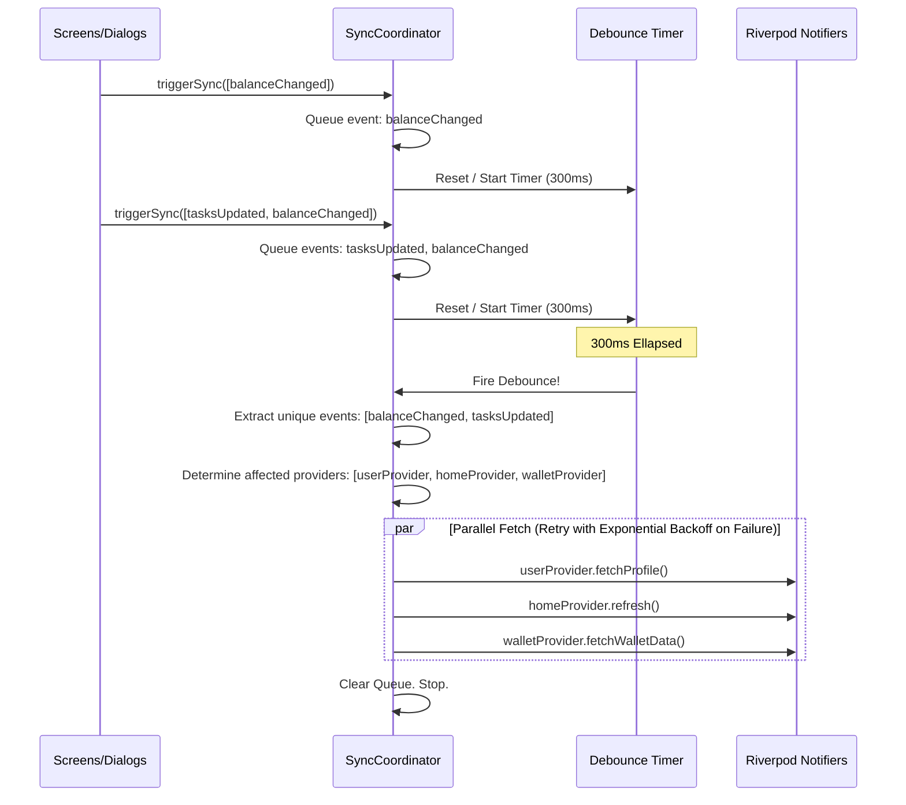

# Centralized Sync Coordinator Architecture (Revised)

This plan incorporates:
1. **Event-Based Refresh Scopes**: Granular refreshing of only the affected providers instead of sweeping `refreshAll()`.
2. **Sync Queue + Debouncing**: Debounce multiple incoming sync events to merge duplicates and prevent parallel API spam.
3. **Retry & Error Handling**: Controlled retry mechanism with exponential backoff for failed provider refreshes.

---

## 1. SyncEvent Scope Definitions

```dart
enum SyncEvent {
  balanceChanged,  // Requires: userProvider (balance), homeProvider (balance), walletProvider (transactions)
  profileUpdated,  // Requires: userProvider (userData), homeProvider (recent rewards/details)
  tasksUpdated,    // Requires: homeProvider (milestones/claims)
  networkUpdated,  // Requires: networkProvider, userProvider (referral balance)
}
```

---

## 2. Queueing & Debouncing Flow



---

## 3. Production Code Implementation Files

1. **[NEW]** [sync_coordinator.dart](file:///E:/development/SikkaPlay/lib/core/sync/sync_coordinator.dart) - Handles event queuing, debouncing, scope mapping, and robust retries.
2. **[MODIFY]** [user_controller.dart](file:///E:/development/SikkaPlay/lib/features/profile/controllers/user_controller.dart) - Removes home triggers, links mutations to the coordinator.
3. **[MODIFY]** [home_controller.dart](file:///E:/development/SikkaPlay/lib/features/home/controllers/home_controller.dart) - Removes user triggers, links mutations to the coordinator.
4. **[MODIFY]** [game_claim_dialog.dart](file:///E:/development/SikkaPlay/lib/features/games/shared/utils/game_claim_dialog.dart) - Updates endgame claims.
5. **[MODIFY]** [daily_code_screen.dart](file:///E:/development/SikkaPlay/lib/features/home/screens/daily_code_screen.dart) - Updates daily code claim callbacks.
6. **[MODIFY]** [visit_earn_screen.dart](file:///E:/development/SikkaPlay/lib/features/home/screens/visit_earn_screen.dart) - Updates visit links claim callbacks.
